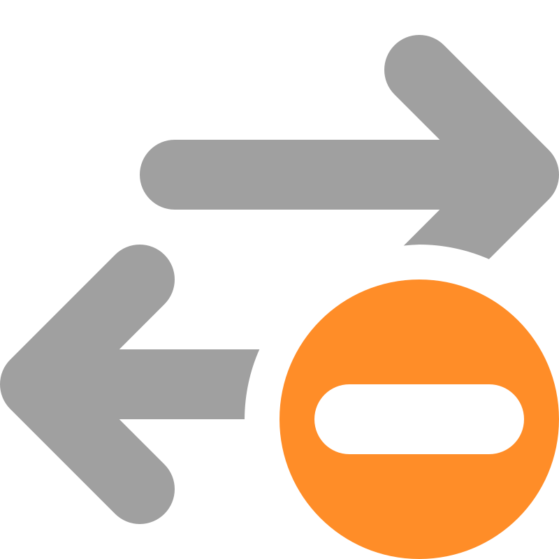

<p align="center">
  
</p>

<h1 align="center">Ping Warden</h1>

<p align="center">
  <strong>Stop AWDL lag spikes during cloud gaming on your Mac.</strong>
</p>

<p align="center">
  <code>event-driven protection</code> &bull;
  <code>macOS 13+</code> &bull;
  <code>Intel and Apple silicon</code> &bull;
  <code>signed and notarized</code>
</p>

<p align="center">
  <a href="https://github.com/oliverames/ping-warden/releases/latest"></a>
  <a href="LICENSE"></a>
  <a href="https://amesconsulting.gumroad.com/l/pingwarden"></a>
</p>

<p align="center">
  <a href="https://pingwarden.app">Website</a> &bull;
  <a href="#install-approve-and-verify">Install</a> &bull;
  <a href="#pricing">Pricing</a> &bull;
  <a href="#how-it-works">How it works</a> &bull;
  <a href="#control-center-toggle">Control Center</a> &bull;
  <a href="#privacy">Privacy</a> &bull;
  <a href="#documentation">Documentation</a> &bull;
  <a href="#build-from-source">Build</a>
</p>

---

Ping Warden (formerly AWDL Control) is an open source (MIT) Mac app for cloud gaming that you control from the menu bar or, on macOS 26, a native Control Center toggle. AWDL can contribute to Wi-Fi stutters in GeForce NOW, Xbox Cloud Gaming, self-hosted streaming through Moonlight or Parsec, and other latency-sensitive games or calls. Ping Warden keeps it paused while you play. The source stays MIT. The dashboard, latency history, diagnostics, and updates are free.

Ping Protection watches Apple Wireless Direct Link (AWDL), the interface used by AirDrop, AirPlay, Handoff, and other nearby-device features, and keeps that interface down while it is active. The prebuilt app requires a one-time $15 license to enable Ping Protection, including starting a protected Latency Session. Eligible existing users receive the [90-day transition described below](#pricing). Visit [pingwarden.app](https://pingwarden.app/) for the product website and [complete documentation](https://pingwarden.app/docs/).

<p align="center">
  
</p>

## The tradeoff

Ping Protection temporarily makes AirDrop, AirPlay, Handoff, and other AWDL-dependent features unavailable on your Mac. Turn protection off when you need them, or use the 10-minute pause from the menu bar. Ping Warden restores AWDL when protection stops and during its removal flow.

That tradeoff is the point of the app. You choose when a latency-sensitive game or call matters more than nearby-device features.

## Why this exists

Running `sudo ifconfig awdl0 down` once is not enough because macOS can bring AWDL back up automatically. A timer-based script reacts after the interface is already active, which still leaves time for channel switching to affect the connection.

## How it works

Ping Warden uses a privileged helper that waits for kernel route and interface events. When macOS tries to raise `awdl0` while Ping Protection is on, the helper attempts to lower it and increments an intervention counter. That count records attempts, not confirmed blocks or measured spikes prevented. The dashboard puts the counter next to live latency, jitter, probe failures, and history so you can compare the readings on your own network.

## Control Center toggle

On macOS Tahoe 26 or later, Ping Protection is also a native Control Center control. Open Control Center, click **Edit Controls**, and add **Ping Protection**. You can drag it to the menu bar too, next to Wi-Fi and Sound. The toggle reflects whether protection is actually on, including when Game Mode or a Latency Session turned it on.

To keep one icon instead of two, turn on **Settings → Automation → Hide Menu Bar Icon**. The toggle then replaces Ping Warden's menu bar icon, and the app stays in the Dock so settings remain one click away. The control needs a signed release build, and turning protection on still requires a license or an active transition.

## Install, approve, and verify

### 1. Get the app

Buy the [Ping Warden License on Gumroad](https://amesconsulting.gumroad.com/l/pingwarden). The signed, notarized DMG is attached to the purchase, so it is in your receipt and your Gumroad library, and the license key arrives in the same email. Open the DMG, drag Ping Warden to `/Applications`, and launch the copy in Applications.

Want to try the free features first? The same build is on [Releases](https://github.com/oliverames/ping-warden/releases/latest). The dashboard, latency history, diagnostics, and updates work without a key. Enabling Ping Protection, including starting a Latency Session, requires a license or an active transition. Any official build accepts the key from a later purchase.

**On version 2.0.5 or earlier? Download the current version once.** Early builds either lack an updater or have incomplete updater configuration. Quit Ping Warden, [download the latest DMG](https://github.com/oliverames/ping-warden/releases/latest), and replace the copy in Applications. Launch it from Applications afterward.

**On a later version?** Choose **Check for Updates** from the menu bar icon. If no update appears or installation fails, use the same manual download. Before 4.1.6, automatic checks could depend on helper approval. Version 4 asks you to accept the licensing change before an in-app upgrade. Eligible existing users receive a 90-day transition, starting at their first launch of version 4 with protection enabled and the helper approved. See [updating from an earlier version](Site/guides/updating-from-an-earlier-version.md).

### 2. Activate your license

Open **Settings → License** and enter the key from your receipt. The app verifies once with Gumroad and then works offline for up to 14 days. That pane also shows the deadline if you have an active transition. Existing users and pre-version-4 donors should read [Pricing](#pricing) first, since you may not need to buy anything yet.

### 3. Approve the helper

The welcome appears automatically once. Choose **Not Now** to use the free dashboard and finish setup later.

In the welcome window, click **Turn On Ping Protection** after activation. If you already closed it, open **Settings → General** and click **Finish Setup**. Approve Ping Warden in System Settings when macOS asks. This one-time approval lets the app control wireless sharing.

### 4. Turn on Ping Protection and verify it

Enable **Ping Protection** from the menu bar or the [Control Center toggle](#control-center-toggle). Without a key (and outside the transition window) the app points you back to **Settings → License** instead of turning protection on. Open the dashboard and confirm that protection is active. The dashboard shows live latency and counts the helper's intervention attempts when macOS reactivates AWDL.

The [Quick Start guide](PingWarden/QUICKSTART.md) covers first-run setup and the optional automation features.

## What Ping Warden includes

| Feature | What it does |
|---------|--------------|
| Ping Protection | Keeps `awdl0` down with an event-driven privileged helper |
| Live dashboard | Tracks latency, jitter, probe failures, history, and helper interventions |
| Game Mode auto-detect | Turns protection on when a recognized game is the frontmost app, with no permission needed; optional Screen Recording access also catches fullscreen games behind other windows |
| Quick pause | Restores nearby-device features for 10 minutes, then returns to your previous protection state |
| [Control Center toggle](#control-center-toggle) | Turns protection on or off from Control Center or the menu bar on macOS 26 or newer, and can replace Ping Warden's own menu bar icon |
| Diagnostics export | Creates a local support snapshot that you can review before sharing |
| Automatic updates | Uses Sparkle and signed update metadata to deliver new releases |

Apple added third-party Mac controls to Control Center in [macOS Tahoe 26](https://developer.apple.com/videos/play/wwdc2025/278/?time=536), which is why the toggle has a newer requirement than the rest of the app.

Ping targets include common public services, discovered GeForce NOW regions, your network gateway, and targets you add yourself.

## Pricing

Ping Warden stays open source under MIT. You can build from source, inspect it, and modify it under MIT whether you pay or not. The prebuilt, signed, and notarized app is free to download. The dashboard, latency history, diagnostics, and updates are free to use.

**Why a license:** After two years of free builds, donations cover only a fraction of the ongoing work — Developer ID signing, Apple notarization, testing across macOS releases, and release engineering. A one-time $15 license for the Ping Protection feature makes that work sustainable without subscriptions, ads, or analytics. The tradeoff that defines this app stays exactly the same, and the source stays auditable under MIT.

Enabling Ping Protection in the prebuilt app, including starting a Latency Session, requires a license or an active transition. Buy the license at [Gumroad](https://amesconsulting.gumroad.com/l/pingwarden). One key works on the Macs you own. The app verifies once with Gumroad, then re-checks roughly every 6 hours while it runs and once at launch; verification is offline-friendly for up to 14 days.

**Transition for existing users:** If protection was enabled with an approved helper when you first launched version 4, it remains available for 90 days from that launch. Updates preserve the original deadline. Check the time remaining in **Settings → License**. When the transition ends, enter a license key to keep protection available. The app introduces the transition once and reminds eligible users twice more, when 30 days and 7 days remain, showing the days left. Reminders are held while a detected game or latency session is active, appear the next time you use Ping Warden, and stop after license activation. A reminder missed while the app was closed does not stack with the next one.

**Donors:** If you supported Ping Warden through [Buy Me a Coffee](https://www.buymeacoffee.com/oliverames) before version 4, email [oliver@ames.consulting](mailto:oliver@ames.consulting) with your receipt and it will be honored as a full license.

## Privacy

Latency history, protection state, settings, and intervention counts stay on your Mac. Ping Warden does not send usage analytics.

The app makes a few narrow outbound requests:

- Sparkle checks the public appcast for updates.
- License activation and refresh send your license key and the product ID to Gumroad over HTTPS. Your key stays in the macOS Keychain between checks.
- The dashboard checks `status.geforcenow.com` to discover GeForce NOW target hostnames.
- Starting with version 4.2.0, anonymous crash reporting is on by default when no choice has been saved. Updates preserve your saved choice, including an opt-out. Turn it off under **Settings > Advanced > Privacy** to stop new reports immediately. Turning it back on requires a relaunch. Reports exclude ping targets, network breadcrumbs, performance traces, and app-lifecycle tracking. IP-address storage is disabled in the reporting service.
- TCP latency probes connect only to the target you select or ask Ping Warden to choose.

Diagnostics exports are written locally. Ping Warden never uploads them for you.

## Support Ping Warden

Buying a [license](https://amesconsulting.gumroad.com/l/pingwarden) is the most direct way to support the work, and it is what unlocks Ping Protection in the prebuilt app. See [Pricing](#pricing) for the terms, the existing-user transition, and the donor path.

## Documentation

- [Documentation website](https://pingwarden.app/docs/) includes the complete guides below, pricing, privacy, and release notes.
- [Quick Start](PingWarden/QUICKSTART.md) covers installation and first-run setup.
- [Full documentation](PingWarden/README.md) explains the architecture, settings, and operating model.
- [Troubleshooting](PingWarden/TROUBLESHOOTING.md) provides safe recovery steps and diagnostic commands.
- [Release notes](RELEASE_NOTES.md) record changes by version.
- [GitHub Issues](https://github.com/oliverames/ping-warden/issues) is the place to report a reproducible problem or request a feature.

## Build from source

```bash
git clone https://github.com/oliverames/ping-warden.git
cd ping-warden
swift test
open PingWarden/PingWarden.xcodeproj
```

The app requires macOS 13 or newer. Configure signing for the app, helper, and widget targets before running from Xcode. The full helper-registration flow only works when the built app is installed in `/Applications`; non-helper UI work can run from Xcode.

## Credits

- [jamestut/awdlkiller](https://github.com/jamestut/awdlkiller) provided inspiration for Ping Warden's approach to AWDL control.
- [james-howard/AWDLControl](https://github.com/james-howard/AWDLControl) provided a reference for the SMAppService and XPC architecture.

## License

The source code is MIT, Copyright (c) 2025-2026 Oliver Ames — build it, inspect it, and modify it under MIT whether you buy a license or not. See [LICENSE](LICENSE) for the full terms.

The prebuilt, signed, and notarized app is free to download. The dashboard, latency history, diagnostics, and updates are free to use. Enabling Ping Protection, including starting a Latency Session, requires a purchased key or an active transition. [Pricing](#pricing) covers what it costs, how verification works, and how the existing-user transition and donor path apply.

---

<p align="center">
  <sub>
    Built by Oliver Ames in Vermont
    &bull; <a href="https://github.com/oliverames">GitHub</a>
    &bull; <a href="https://linkedin.com/in/oliverames">LinkedIn</a>
    &bull; <a href="https://bsky.app/profile/oliverames.bsky.social">Bluesky</a>
  </sub>
</p>
