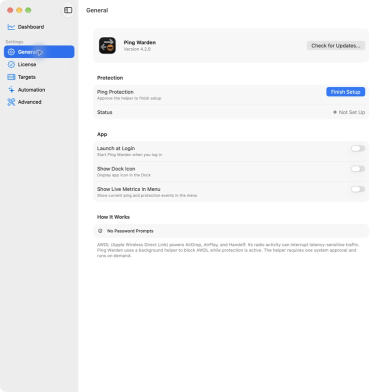
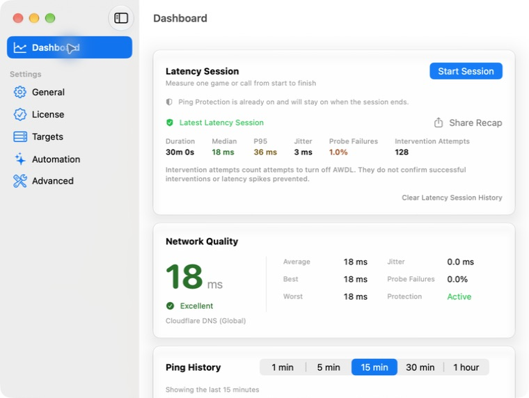
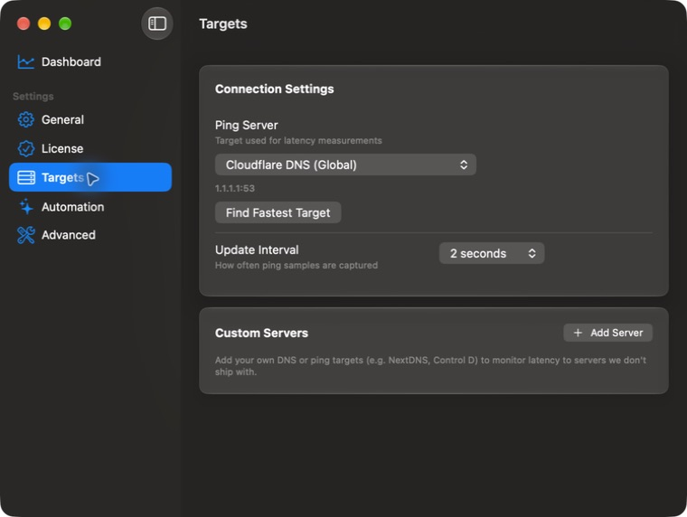

# Ping Warden UI review on macOS 27

Author: Oliver Ames  
Review date: September 21, 2026

## Assessment

Ping Warden has a sound native foundation. Its real window uses a standard unified toolbar, leading pane titles, native sidebar selection, system Forms, familiar controls, and ordinary Mac window behavior. The long “Isolated view fixture” title seen earlier belonged to a temporary test host. It is absent from the real window composition. Preserve the repaired hosting architecture.

It does not yet have the consistency expected of an Apple app. The main visual mismatch is Liquid Glass applied to dashboard and target content cards. Several interaction details also need correction: pending settings state disappears, Return does not verify a license, a full URL is accepted as a server host, and the final transition reminder promises future reminders. These are specific findings, not a recommendation for a wholesale redesign.

The counter wording defect was fixed in `8bad3e7` and [#88 is closed](https://github.com/oliverames/ping-warden/issues/88). The review also reproduced a missing Help-menu release-notes command within [#78](https://github.com/oliverames/ping-warden/issues/78). Its fix and final verification are recorded below.

## Scope and method

The source inventory covers all 21 groups of app windows, sidebar panes, menus, dialogs, and the Control Center control. The review host runs macOS 27.2, build 26B5086k. The review began at `334038c0e66adb3c92a7c17e368359d840a02923`, after release 4.2.0.

A separate full-app build preserves the production SwiftUI views, native AppKit windows, sidebar, and menu structure. Its service boundaries use synthetic state. Preferences and licensing are in memory, identifiers are distinct, and exports stay in a temporary directory. Probe networking, helper registration, XPC, login items, updates, telemetry, and removal are disabled. Window links use inert URL handlers. The final menu check also guards the three static Help links at their command boundary, after the review identified that the window handler did not cover them. Those links were never activated. The release window geometry is reproduced. This protects the installed app and user data while exposing the real window composition.

This review does not establish signed helper/widget operation, real latency or game behavior, update installation, or production persistence. The installed copy was not replaced. Each runtime observation below distinguishes actual interaction from source inspection or simulated data.

## Apple guidance

The criteria come from Xcode's local Apple documentation archive. Searches did not find a separate macOS 27-specific design standard. These are current general macOS guidelines, applied on macOS 27.2.

- Use native controls, recognizable window roles, and predictable pane navigation. [Windows](https://developer.apple.com/design/human-interface-guidelines/windows), [Settings](https://developer.apple.com/design/human-interface-guidelines/settings#macOS), [Sidebars](https://developer.apple.com/design/human-interface-guidelines/sidebars).
- Reserve Liquid Glass for the functional layer. Apple says, “Don’t use Liquid Glass in the content layer.” Data cards should use standard content backgrounds or materials. [Materials](https://developer.apple.com/design/human-interface-guidelines/materials#Liquid-Glass).
- Prefer automatic scroll-edge behavior and restrained toolbar customization. [Scroll views](https://developer.apple.com/design/human-interface-guidelines/scroll-views#Scroll-edge-effects), [Toolbars](https://developer.apple.com/design/human-interface-guidelines/toolbars).
- Test keyboard access, meaningful accessibility descriptions, contrast, transparency, motion, and non-color state cues. [Accessibility](https://developer.apple.com/design/human-interface-guidelines/accessibility), [Charts](https://developer.apple.com/design/human-interface-guidelines/charts).
- Test Control Center separately, including compact presentation where title/value text may disappear. [Control refinement](https://developer.apple.com/documentation/widgetkit/adding-refinements-and-configuration-to-controls).

## Source coverage

This is the initial inventory at `334038c`, not a claim that every state below passed interaction testing. App means `PingWarden/PingWarden/PingWardenApp.swift`, Dashboard means `DashboardView.swift` in that directory, and Welcome means `WelcomeView.swift`. The runtime results below supersede the inventory's initial “needs checking” notes.

| Surface | States or interactions to cover | Source anchors | Source-supported keyboard/accessibility/window notes |
| --- | --- | --- | --- |
| Main Settings window and sidebar | All six selections, narrow/default/saved size, sidebar collapse, close/reopen, Dock activation | App:934–1001,1661–1774 | NavigationSplitView and native sidebar List; Command-comma opens existing window; minimum 760×520; release initial 980×1000; Dashboard action grows height up to 1000 regardless of saved shorter size. |
| Dashboard: Latency Session | No history, start, starting, active manual/game, stop, stopping, missing helper/license/error, latest good recap, zero-probe/all-failed recap, recent history expanded, history deletion confirmation, system Share menu | Dashboard:286–569 | Start Command-Shift-S; End Command-Shift-period; destructive clear has explicit confirmation/cancel. Active animation respects Reduce Motion. Recap share hidden without successful measurements. |
| Dashboard: Network Quality | Measuring, successful excellent/good/fair/poor, unreachable, protection active/off, long custom target | Dashboard:575–728 | Combined spoken summary and labeled metrics; non-color symbols for quality; horizontal layout falls back vertically. |
| Dashboard: Ping History | Empty, successful/mixed/failed probes, spike/intervention markers, all five timeframes, Reduce Motion | Dashboard:767–1219 | Labeled segmented picker, spoken summary, AXChartDescriptor with successful/failed probe series. Candidate: summary calls all timeline events protection events. |
| Dashboard: Latency Timeline | Empty, latency spike, one/multiple intervention events, long event list | Dashboard:1222–1270 | Combined event label/time, decorative icons hidden. |
| Dashboard: Protection card and target summary | Protection off/on, zero/nonzero counter, Turn On/Off or Finish Setup, pending/error, Change target navigation | Dashboard:1273–1424,252–280 | Counter success wording tracked in #88. Change sends Settings section navigation. |
| General | Helper unapproved/approved, Finish Setup waiting/failure, persistent toggle/busy/license error, status, counter/reset failure, Launch at Login failure, Dock toggle, metrics toggle, Check for Updates | App:1842–2103 | Native grouped Form. Status has explicit accessible value. Busy Finish Setup replaces its visible text with a spinner (runtime accessibility name unverified). Settings error uses native alert. |
| License | Licensed, transition, never licensed, expired/revoked/unreachable, malformed/empty key, verifying, success/failure, purchase and historical donor links | App:2108–2313 | SecureField labeled. Verify disabled while busy/empty; busy button becomes spinner. No explicit onSubmit/default-action Verify binding. Return-key behavior still needs runtime verification. |
| Targets: connection | Empty/populated picker, selected endpoint, GFN refreshing/failure/retry, fastest-target busy/success/failure, all four intervals | Dashboard:1453–1554 | Menu pickers have explicit labels. Fastest-target busy state retains readable text and accessible label. |
| Targets: custom servers | Empty/list, Add editor, focus/Tab order, invalid/duplicate host, invalid port, save/cancel, remove selected/other server, long names/addresses | Dashboard:1564–1746 | Inline editor, not a sheet. Focus assigned on entry, Return Save, Escape Cancel. Validation moves accessibility focus. Remove is immediate and has no undo/confirmation in this view. |
| Automation | Auto-detect off/on, permission absent/granted, fullscreen permission alert and return from System Settings, Control Center available/unavailable, hide-menu confirmation/cancel | App:2318–2439 | Native grouped Form, disabled unavailable toggle, status badges, explicit toggle labels/hints. Availability refreshes on app activation. |
| Advanced | Crash reporting off/on/relaunch-required, beta channel, helper test busy/result, diagnostics busy/success/failure, Console link, repair confirmation/failure, removal confirmation/failure | App:2445–2839 | Native grouped Form and confirmation dialogs. Destructive removal has explicit role/cancel. Reporting relaunch badge is local @State and resets if this view is recreated. Helper-test/export busy buttons become spinners (runtime accessibility names unverified). |
| Diagnostics result sheet | Long path/content, selection, Copy/Copied, Show in Finder, Done, Return/Escape, minimum size | App:2845–2886 | Scrollable/selectable report; Return Done. No explicit Escape/cancel shortcut. Minimum 560×420. Runtime Escape behavior needs checking. |
| Welcome | Licensed/unlicensed plus idle/waiting/complete/failed, license navigation, Login Items link, close/Not Now, Open Dashboard, large text | Welcome:9–272; App:520–601 | Fixed initial 540×640, non-resizable titled window; default/cancel shortcuts, scrolling and accessibility-size layout. Completion has default Open Dashboard but no Not Now button. |
| License transition notice | Initial notice; reminder with 30 days, 7 days, delayed reminder; purchase, key entry, continue/close; large text | App:606–664,1557–1655 | Fixed 480×560 scrolling window. Return enters key; Escape continues. Reminder wording always promises reminders at 30 and 7 days, even when those thresholds are reached/passed. |
| About | Licensed versus Buy a License, version/build, links, narrow/large text, close/reopen | App:1004–1033,2892–3021 | Resizable titled window, min 380×420; scrolling; horizontal link group falls back vertical; decorative hero hidden. |
| Status menu | Protection helper-missing/off/on/paused/transition, metrics hidden/shown/loading/value, license hidden/shown, What's New absent/present/dismissed, About/Settings/Dashboard/Help/update/quit | App:704–861,1231–1388 | Native NSMenu; explicit icon label/tooltip; menu refresh hides purchase for paid license; metric entries disabled. What's New source behavior already has 24 isolated checks, not signed lifecycle coverage. |
| Application menus | App About/Settings/Check for Updates/Quit; Help documentation/troubleshooting/website/What's New; system Edit/Window menus, shortcuts | App:38–88,1121–1169 | SwiftUI standard command groups with AppKit action rebinding; must inspect actual generated menu tree in full app. |
| App-modal alerts | Updater startup failure: Retry/Download/Copy/Cancel; license denied: Buy/Open Settings/Cancel; quarantine: Releases/Cancel; helper errors: OK | App:1172–1202,1368–1388; QuarantineHelper:71–94; PingWardenMonitor:1193–1203 | NSAlert.runModal; helper generic title is Error. Action semantics can be tested with inert stubs. Avoid real registration/repair/removal during review. |
| Sparkle-owned UI | Update permission prompt, checking, no update, available release, download/install/error | App:199–215,1083–1117 | Third-party native UI. Actual signed app/framework integration needed for full coverage. |
| Control Center widget / Shortcuts intents | Protected/Not Protected, toggle pending, license required, app launch/helper/app-group failure, available versus unsupported install | PingWardenWidget.swift:23–43; PingWardenToggleIntent.swift:24–159 | System-rendered ControlWidgetToggle with value label. Errors carry localized messages. Unsigned fixture cannot establish real widget-host interaction. |

## Runtime coverage and results

| Surface | Observed coverage | Result and limits |
| --- | --- | --- |
| Window and sidebar | Every pane at release default geometry; all six at minimum width; light and app-level dark appearance; sidebar hide/show; About close; Command-comma | Native title follows selection. Sidebar hides and returns correctly. Command-comma targets the existing window. Review autosave is disabled, so production frame persistence is not established. |
| Dashboard | Empty session history, successful synthetic latency, all-failed probes, license refusal, latest synthetic recap, zero and 128 attempts, scrolled lower cards | Layout wraps at 760-point window width. The full 128-attempt recap and explanatory text fit. Failed probes have an explicit unreachable state rather than fabricated latency. Source/data fixture confirms the separate chart-summary bug in #89. |
| General | Helper missing and ready, synthetic active protection, attempt count, default and minimum widths, scrolled footer, light/dark | Native grouped layout remains readable. Footer is reachable. Revised attempt label and reset accessibility name are exposed correctly. |
| License | Licensed, unlicensed, active transition, expired transition, empty/nonempty key, offline error; default and narrow sizes | Licensed and purchase states are clear. Return fails to submit a nonempty key, while clicking Verify invokes the inert verifier. No real key or request was used. Expired transition correctly falls back to the unlicensed entry state. |
| Targets | Empty/custom list, Add editor, initial focus, Tab, Return, long display name, URL-shaped input, light/dark and narrow width | Entry focus and Return-to-save work. Complete URLs are incorrectly accepted as hosts. Target discovery and latency are synthetic; no connectivity result is claimed. |
| Automation | Auto-detect off/on, optional permission explanation, unsigned-control unavailability, default/narrow and light/dark | Native grouped controls and optional permission disclosure are clear. The disabled widget control is an expected unsigned-fixture state, not a product signing failure. |
| Advanced | Default-on reporting, off/on toggle, navigation away/back, beta toggle presentation, diagnostics and maintenance rows, default/narrow and light/dark | Relaunch badge disappears on navigation and is absent from the accessibility representation. Bottom maintenance controls remain reachable by scrolling. |
| Diagnostics | Scratch export, scrollable result sheet, visible path, selectable report, three actions, Escape | Sheet is readable and Escape dismisses it through native behavior. Copy and Finder actions were not executed. Only a temporary report was written. |
| Helper and maintenance alerts | Helper-unregistered error; repair and removal confirmations; Return and Escape | Return dismisses the helper result. Escape cancels repair and removal. The capture tool returned blank native-alert crops, so button/text semantics are verified through accessibility, not a claimed visual alert pass. Destructive operations were not performed. |
| Welcome | Unlicensed minimum size, scrolled purchase disclosure, setup failure, Escape; licensed enlarged-text branch in dark appearance | Actions and privacy disclosure remain reachable. Setup failure gives next steps. The enlargement flag exercises a view branch, not macOS system text-size support. Helper-ready/no-XPC startup can produce a fixture-only helper error. |
| Transition | Initial 90-day notice, final seven-day reminder, Return action into License | No clipped actions. Final-reminder copy is incorrect. Both Buy and Enter Key appear as prominent blue actions, which merits a clearer visual hierarchy. |
| About | Licensed light and unlicensed dark, resource links, version/build, corrected production credits | No donation buttons. Text and links fit. About and transition material captures look washed out with the app-level dark override; verify against true system dark appearance and Reduce Transparency before classifying this as a product contrast defect. |
| Menus | Application menu, Help menu, Command-comma, AppKit status-menu diagnostic snapshot | The pre-fix isolated-app launch omitted the Help offer despite valid state and a native status-menu entry. After the fix, the Help offer appears and disappears after clicking. See #78 below. Earlier method tests alone did not expose this. |
| Control Center and Sparkle | Source and official platform guidance only | These require signed host integration. No claim that their live installed UI or updater flow was exercised in the unsigned review build. |

## Findings and follow-up

1. **Content materials and consistency: [#90](https://github.com/oliverames/ping-warden/issues/90).** Dashboard and Targets cards are elevated glass surfaces, unlike the restrained grouped Forms elsewhere. Replace their content-layer glass with suitable native backgrounds/materials. Preserve standard navigation and toolbar effects. Check scrolling, dark appearance, contrast, and transparency after that change.
2. **Pending crash-reporting state: [#90](https://github.com/oliverames/ping-warden/issues/90).** Turning reporting off and on shows Relaunch Required. Leaving Advanced and returning clears that indicator while the preference stays enabled. The visible badge is also absent from the accessible toggle state. Keep the pending state for the process lifetime and expose it accessibly. Preserve immediate opt-out.
3. **Keyboard and target entry: [#90](https://github.com/oliverames/ping-warden/issues/90).** Return does not submit a nonempty license key. Conversely, Return correctly saves a custom server but accepts `https://example.com/path` as a host. Add the missing license submission action and a clear host-validation rule without rejecting valid IPv4, IPv6, DNS, or local names.
4. **Transition language and action hierarchy: [#90](https://github.com/oliverames/ping-warden/issues/90).** The seven-day reminder promises another reminder at 30 and seven days. Make that text threshold-aware. Consider one visually primary action, since Buy and Enter Key are currently equally prominent while Return chooses Enter Key.
5. **Chart accessibility: [#89](https://github.com/oliverames/ping-warden/issues/89).** The generated summary calls all timeline entries protection events, including latency spikes. Five inert data scenarios reproduced this using unchanged production summary/filtering blocks. Distinguish the types or use a neutral timeline-event count. This confirms generated text, not a complete VoiceOver chart-navigation test.
6. **Existing compiler warnings: [#91](https://github.com/oliverames/ping-warden/issues/91).** Native universal builds report two actor-isolation warnings in the settings-section notification observer. The build succeeds, and no runtime race was demonstrated. Track this separately from visual polish.

Two further design choices deserve a focused pass. The 980×1000 initial window leaves substantial blank space on short settings panes. Opening Dashboard can also enlarge a user-sized window. Consider a less imposing initial size and preserve user sizing. Custom-target deletion is immediate and has no Undo in the view. Consider Undo for recoverability rather than adding confirmation prompts to every edit. The baseline application-menu capture also lacked Check for Updates even though source inserts it. This is tracked for lifecycle verification in #90; the General settings update button remains available.

## Completed counter correction

[#88](https://github.com/oliverames/ping-warden/issues/88) is resolved in [8bad3e7](https://github.com/oliverames/ping-warden/commit/8bad3e7). Settings, status-menu text, dashboard and timeline labels, accessibility, and shared recaps now describe intervention attempts. Success-checkmark imagery and the ambiguous “Since Launch” heading were removed from attempt displays. Stored counts, XPC, and helper behavior are unchanged.

All nine affected summary tests pass, including zero, one, and multiple attempts. All 162 helper checks pass, including the injected failed write that still advances the counter. The app, helper, and widget build successfully for both architectures. Signing configuration and entitlement files were not changed. The full isolated app verifies the longer labels at minimum width. This is a source correction, not a new published or installed release.

## Help-menu correction

Before the fix, diagnostics recorded `whatsNewVersion=4.2.0`, remembered version `4.1.9`, and the AppKit status-menu item present. At both one and five seconds after launch, Help still contained only its three static links. This reproduces the missing command within #78 and explains why earlier policy and native-menu unit checks were insufficient.

The Help contents now live in a `Commands` type in [e315918](https://github.com/oliverames/ping-warden/commit/e315918) that observes the existing AppDelegate directly. In the rebuilt full app, Help displays “What's New in 4.2.0...” after launch. Selecting it clears the offer, and reopening Help confirms the item is gone. The native universal Release build succeeds with no new warnings. The three documentation links and release-notes action retain their production destinations and behavior; scratch URL adapters prevent external navigation during this check.

This verifies the full unsigned menu lifecycle. It does not establish signed production preference persistence or real browser navigation. The existing source-level release-anchor tests remain complementary evidence. Original signed-app acceptance and real-game validation remain separate.

## Representative captures

All counts, licenses, latency values, and service states in these screenshots are synthetic. The native view and window structure are production code. Captures after the #88 correction include its updated labels.

Further evidence:

- [Corrected attempt counter at narrow width](images/ui-review-2026-09-21/dashboard-counter-narrow-light.png)
- [Relaunch badge before navigation](images/ui-review-2026-09-21/advanced-relaunch-badge.png) and [missing after returning](images/ui-review-2026-09-21/advanced-relaunch-badge-after-navigation.png)
- [License verifier error at narrow width](images/ui-review-2026-09-21/license-offline-error-dark.png)
- [Advanced maintenance controls after scrolling](images/ui-review-2026-09-21/advanced-narrow-dark-footer.png)
- [Welcome purchase disclosure at minimum size](images/ui-review-2026-09-21/welcome-unlicensed-min-light-scrolled.png)
- [Seven-day reminder](images/ui-review-2026-09-21/transition-seven-day-light.png)
- [Diagnostics sheet](images/ui-review-2026-09-21/diagnostics-sheet.png)
- [About with app-level dark override](images/ui-review-2026-09-21/about-unlicensed-dark-active.png), with the contrast-verification caveat above

## Remaining verification boundaries

The review did not change system accessibility preferences or replace the installed app. True system dark appearance, Increase Contrast, Reduce Transparency, Reduce Motion, larger macOS sidebar settings, and spoken VoiceOver navigation remain to be exercised on the signed application. Accessibility-tree inspection and source checks do not substitute for those tasks. Persistent frame restoration, signed Control Center hosting, and Sparkle-owned windows also remain outside the fixture results.

[#78](https://github.com/oliverames/ping-warden/issues/78) retains the signed-app interaction checks. [#64](https://github.com/oliverames/ping-warden/issues/64) retains licensed real-game, focus restoration, and connected-Ethernet observations. Only Wi-Fi is available on this Mac. Neither issue is marked complete from unit tests or simulated state. The installed 4.1.8 app, published 4.2.0 release, production preferences, license, helper, and network configuration were preserved.

## Final verification checkpoint

The review app was closed after testing. A read-only check confirmed that neither it nor the installed app was running. The installed copy remains 4.1.8/build 41800 with its valid Developer ID signature and stapled ticket. Production state remains unchanged. The new source fixes were built locally with signing disabled, so this is not a claim that a new signed release was produced.

At the final September 21 wrap-up check, [Build Verification](https://github.com/oliverames/ping-warden/actions/runs/35640757995) passed for application commit `e3159181705c9f87f65a2bc0f97a15339cdda7d6`. [Build Verification for the review commit](https://github.com/oliverames/ping-warden/actions/runs/35641185750) also passed. CodeQL remained in progress for both the [application](https://github.com/oliverames/ping-warden/actions/runs/35640758021) and [review](https://github.com/oliverames/ping-warden/actions/runs/35641185609) commits. Local builds and affected tests passed. GitHub accepted the instructed main-branch pushes while required remote checks were pending; completed CodeQL analysis is not claimed here.

The remaining release of both source fixes and final CI review are explicitly tracked in [#78](https://github.com/oliverames/ping-warden/issues/78). [#90](https://github.com/oliverames/ping-warden/issues/90) now also carries the window-sizing and deletion-recovery decisions, system accessibility checks, saved-frame restoration, and signed Control Center/Sparkle coverage. These additions preserve the review's unfinished boundaries rather than treating the inventory as completed runtime coverage.
